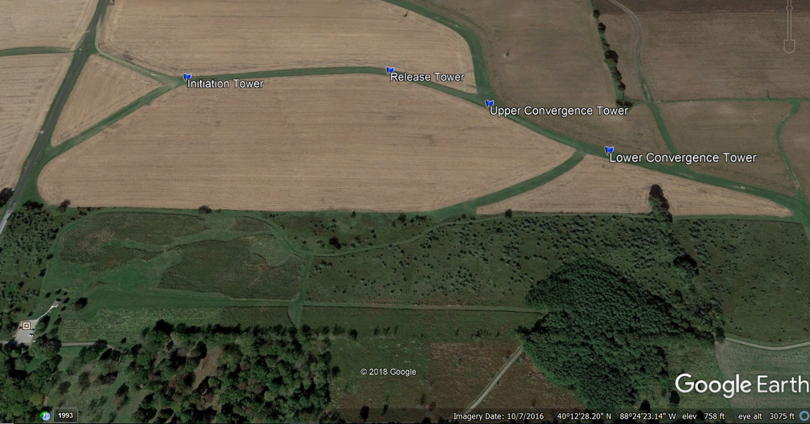
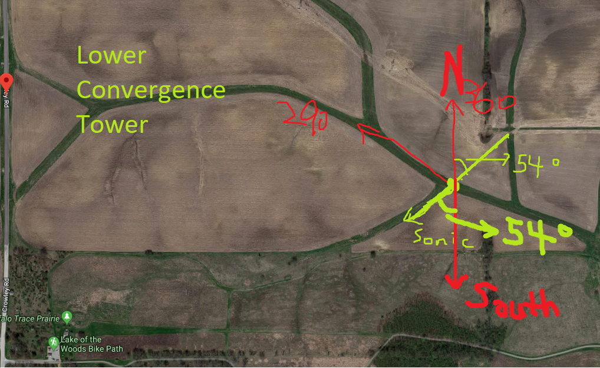
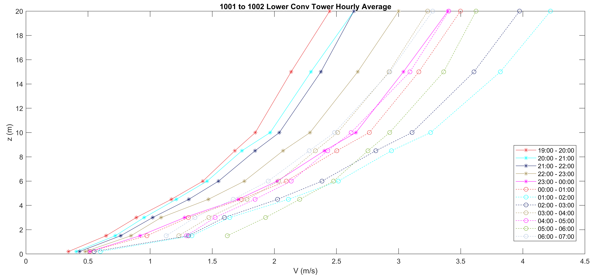
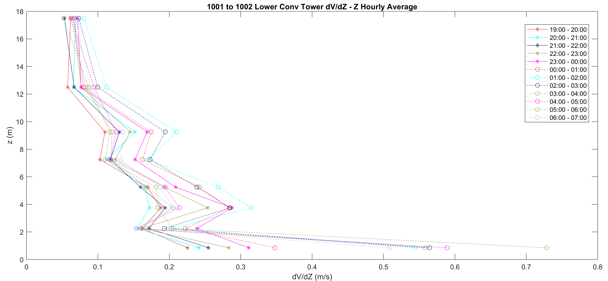
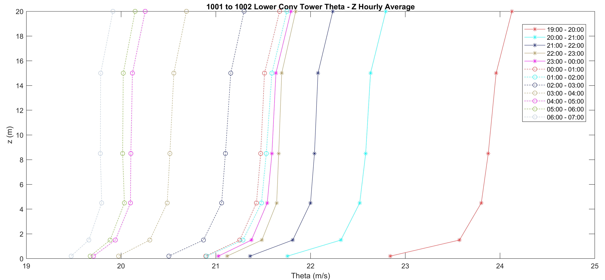

# Jielun’ CASES-99 based Analysis

In this documentation, we will list out the progress being done for the analysis and the findings of such.

## 0. Getting Started

The current study is aiming at finding if our SAVANT field data has similar turbulence effect happened under Stable Boundary Layer.

As for ==CASES-99==:

> The Cooperative Atmospheric Surface Exchange Study October 1999 (CASES-99) field observational program represents the second study to investigate linkages between the atmosphere and the Earth's surface. This study is designed to examine events in the nighttime boundary layer, and to investigate the physical processes associated with evening and morning transition regimes. The overall effort encompasses observation, data analyses and numerical modeling to achieve an understanding of episodic events that populate the nighttime stable boundary layer.													— [NCAR](https://www.eol.ucar.edu/field_projects/cases-99)

## 1. Data Description

The following types of data being collected during the experiment period are put into analysis.

| Device Type            | Resolution [MM:SS] | Description                                                  |
| ---------------------- | ------------------ | ------------------------------------------------------------ |
| Sonic Sensor           | 05:00              | The climate monitoring sonic sensors which were installed on 4 primary multi-level flux profile towers. For more information, please visit [Data Report.](https://data.eol.ucar.edu/datafile/nph-get/560.001/SAVANT_ISFS_Data_Report.pdf) |
| Dusttrak               | 00:01              | The Aerosol Monitor provides real-time aerosol mass readings with gravimetric sampling. For more information, please visit [Product Page.](https://tsi.com/products/aerosol-and-dust-monitors/dust-monitors/dusttrak-ii-aerosol-monitor-8530/) |
| Optical Particle Sizer | 00:01              | The OPS measures particles from 0.3 to 10 µm in 16 user adjustable size channels. For more information, please visit [Product Page.](https://tsi.com/products/particle-sizers/particle-size-spectrometers/optical-particle-sizer-3330/) |

### 1.1 Flux Tower Location

The experiment location is located at ==Crowley Rd Mahomet Township, IL 61853.==



| Flux Tower Name                 | Geo-location                 |
| ------------------------------- | ---------------------------- |
| Initiation Tower [Init]         | 40°12'41.46"N, 88°24'37.99"W |
| Release Tower [Rel]             | 40°12'42.04"N, 88°24'25.52"W |
| Upper Convergence Tower [Uconv] | 40°12'39.78"N, 88°24'19.61"W |
| Lower Convergence Tower {Lconv} | 40°12'36.91"N, 88°24'13.26"W |

### 1.2 Sonic Sensor Boom Direction

| Location | Angle | Type         |
| -------- | ----- | ------------ |
| Init     | 38°   | M (Magnetic) |
| Rel      | 108°  | M            |
| Uconv    | 132°  | M            |
| Lconv    | 54°   | M            |

The angle represents the degree in between the direction where the sensor arm is pointing at, and the direction of geological South. For example, at lower convergence tower:



### 1.3 Aerosol Monitor Device Mapping

**Dustrak8530, 8520, OPC Setup Map (10/11/2018-10/12/2018)**

| Height | Initiation  Tower                                        | Release Tower      | Upper Convergence Tower | Lower Convergence Tower     |
| ------ | :------------------------------------------------------- | :----------------- | ----------------------- | --------------------------- |
| 6.0 m  |                                                          |                    |                         | DT9 8530                    |
| 3.0 m  | DT5 – 8530  (see  section 7 for instrument descriptions) | OPC1               | DT8 -8530               | OPC2                        |
| 1.5 m  |                                                          | DT7 –8530          |                         | DT10 – 8530                 |
| 0.5 m  |                                                          |                    |                         |                             |
| 0.0 m  |                                                          | DT6 8530  DT3 8520 |                         | DT2 8520 (no data recorded) |

**Dustrak8530, 8520, OPC Setup Map (10/15/2018-10/16/2018)**

| Height | Initiation  Tower | Release  Tower | Upper  Convergence Tower | Lower  Convergence Tower |
| ------ | ----------------- | -------------- | ------------------------ | ------------------------ |
| 6.0 m  |                   |                |                          | DT9 8530                 |
| 3.0 m  | DT5 – 8530        | OPC1           | DT8 -8530                | OPC2                     |
| 1.5 m  |                   | DT7 –8530      |                          | DT10 – 8530              |
| 0.5 m  |                   |                |                          |                          |
| 0.0 m  |                   | DT6 8530       | DT3 8520                 | DT2 8520                 |

**Dustrak8530, 8520, OPC Setup Map (10/17/2018-10/18/2018)**

| Height | Initiation Tower | Release Tower            | Upper Convergence Tower | Lower Convergence Tower     |
| ------ | ---------------- | ------------------------ | ----------------------- | --------------------------- |
| 6.0 m  |                  |                          |                         | DT9- 8530(no data recorded) |
| 3.0 m  | DT5 – 8530       | OPC1                     | DT8 -8530               | OPC2                        |
| 1.5 m  |                  | DT7 –8530                |                         | DT10 – 8530                 |
| 0.5 m  |                  |                          |                         |                             |
| 0.0 m  |                  | DT6 8530 at 0.4 m Smoker | DT2-8520                | DT3-8520                    |

 **Dustrak8530, 8520, OPC Setup Map (10/23/2018-10/24/2018, 10/27/2018, 10/29/2018-10/30/2018,)**

| Height | Initiation Tower | Release Tower            | Upper Convergence Tower | Lower Convergence Tower |
| ------ | ---------------- | ------------------------ | ----------------------- | ----------------------- |
| 6.0 m  |                  |                          |                         | DT9- 8530               |
| 3.0 m  | DT5 – 8530       | OPC1                     | DT8 -8530               | OPC2                    |
| 1.5 m  |                  | DT7 –8530                |                         | DT10 – 8530             |
| 0.5 m  |                  |                          |                         |                         |
| 0.0 m  |                  | DT6 8530 at 0.4 m Smoker | DT2-8520                | DT3-8520                |

**Dustrak8530, 8520, OPC Setup Map (11/2/2018-11/3/2018, 11/7/2018-11/8/2018, 11/10/2018, 11/11/2018-11/12/2018, 11/13/2018-11/14/2018)**

| Height | Initiation Tower | Release Tower | Upper Convergence Tower | Lower Convergence Tower |
| ------ | ---------------- | ------------- | ----------------------- | ----------------------- |
| 6.0 m  |                  |               |                         | DT9- 8530               |
| 3.0 m  | DT5 – 8530       | OPC2?         | DT8 -8530               |                         |
| 1.5 m  |                  | DT7 –8530     |                         | DT10 – 8530             |
| 0.5 m  |                  |               |                         |                         |
| 0.0 m  |                  | DT6- 8530     | DT2-8520                | DT3-8520                |

## 2. Data Extraction

### 2.1 Sonic Sensor Data

The sonic sensor data was extracted by using ==NCToolkit==, for more information, please visit [==NCToolkit== Manual](doc/nc_manual.html).

Do notice that:

The filename follows:

```bash
<MMDD>_<DataCategory>.csv
```

For example, <kbd>1018_3DWind.csv</kbd> refers to ==19:00== on `October 17` to ==18:59== on `October 18`. This is because the original data was stored in ==UTC== time zone. The current data extraction tool has converted the time into ==CDT== time zone. 

### 2.2 Dusttrak Data

The Dusttrak data was extracted by using ==DusttrakGrouperTool==, for more information, please visit  ==DusttrakGrouperTool== Manual. Similarly, the data has been aligned in the same style as sonic sensor data. Therefore, the time range correction is the same as stated above.

## 3. Data Filtering

Based on [Jielun's CASE-99 analysis]( [https://journals.ametsoc.org/doi/pdf/10.1175/1520-0477%282002%29083%3C0555%3ACACIOT%3E2.3.CO%3B2](https://journals.ametsoc.org/doi/pdf/10.1175/1520-0477(2002)083<0555%3ACACIOT>2.3.CO%3B2), in order to perform numerical analysis for turbulence regimes and turbulence intermittency in the stable boundary layers, the ideal weather condition should be stable and dry. Hence, we filter the experimental data based on the following criteria.

After reviewing Jielun's analysis performed on CASE-99, which were published in 2002, 2003, 2012, and 2016, I was not able to find any comments on data selection. According to weather history, there were dates during the data collection period for CASE-99 where extreme weather conditions occurred. 

In addition, after examining the publications listed under [CASE-99 Publications](https://www.eol.ucar.edu/node/387/publications) page, only vague descriptions were given on the data qualification. After discussion with Dr. Junming Wang and Dr. David Kristovich, the following approaches were taken based on difference criteria to select qualified data. 

### 3.1 Corrupted Datasets

During the data collection period, sensors can be offline, or malfunction during operation. Under some occasions, we witness that on the same tower, sensors at certain height can have missing data samples. For example:

In order to maintain the data integrity, at the time when one or more sensor at a given tower is missing, all data samples being collected at the time will be removed.

This filter is being applied to all the flux tower datasets.

### 3.2 Sonic Sensor Boom Angle

According to Jielun's study:

> Since the sonic anemometers were all mounted on booms pointing eastward, turbulent fluxes associated with winds from 270° ± 60° could be distorted by the 60-m tower; therefore, all the flux data from this sector were eliminated from this analysis.
>
> ​             — [Turbulence Regimes and Turbulence Intermittency in the Stable Boundary Layer during CASES-99](https://journals.ametsoc.org/doi/full/10.1175/jas-d-11-082.1?mobileUi=0)

Based on the installation information mentioned in **Section 1.2**, if wind direction falls from the following range will be removed:

| Tower ID | Starting Angle | End Angle |
| -------- | -------------- | --------- |
| Init     | 338°(-22°)     | 98°       |
| Rel      | 48°            | 168°      |
| Uconv    | 72°            | 192°      |
| Lconv    | 354°(-6°)      | 114°      |

This filter is only applied to wind speed and wind direction datasets, temperature datasets were excluded from this filter.

### 3.3 Weather Conditions

The following rules are being applied to separate the observation datasets into different groups.

#### 3.3.1 Precipitation

Precipitation brings high humidity condition during the experiments. The precipitation will lead to high thermal exchange post the precipitation period. This can cause instability environmental condition which is not suitable for our study. Hence, the following condition is being used in order to filter out instability period. `Precip.` is the variable of measured precipitation represented in the hourly climate data.

```bash
Precip. > 0.00 in
```

#### 3.3.2 Weather Condition

Since the precipitation resolution is only `0.01 in` collected from the hourly weather station. Sometimes, light rain or short storm was not able to be properly reflected on hourly precipitation collection. Therefore, regular expression method is being used in order to sort out these un-measurable sampling periods. In the hourly climate data, variable `Condition` is used for observers to record current weather condition at the given time. Hence, the following condition is being used in order to filter out instability period.

```bash
Condition == 'Rain'|'Wintry Mix'|'Storm'|'Snow'
```

Note that, for `Condition == 'Rain`, `Light Rain`, `Heavy Rain` are all included since these condition all contains the token `Rain`.

#### 3.3.3 Related Thermal Instable Period

Post precipitation period, as the sensors are covered with moisture, according to technicians, 2 hours are usually needed for the surface of the sensors to dry out. During the drying period, the accuracy of the data may be affected due to local thermal exchange. Therefore, in order to avoid potential data corruptions, data from the hour before the starting of precipitation, along with 2 hours post the precipitation periods are being removed. 

## 4. Data Visualization

The following data visualizations were practiced.

### 4.1 Wind Speed Hourly Average



The horizontal axis represents the wind velocity with a unit of meters per second denoted as `V`. As for the vertical axis, it represents the height denoted as `z` with a unit of meter. And as for each plotted lines, each marker on the line represents an average value of wind velocity at the respective height based on a period of 1 hour of 5-min sampled data samples. If a marker is missing at a certain height at a given hour, there are following possibilities which resulted in the issue:

1. Sonic sensor was not operating at the given time;
2. The wind direction falls into the interfering range noted in **Section 3.2**.

### 4.2 Wind Shear Hourly Average



The horizontal axis represents the wind shear with a unit of meters per second denoted as `dV/dZ`. It is calculated based on the following equation:
$$
\frac{dV}{dZ} = \frac{V_{Higher Height} - V_{Lower Height}}{Z_{Higher Height} - Z_{Lower Height}}
$$
As for the vertical axis, it represents the height denoted as `z` with a unit of meter. The height is being assigned as:
$$
z = \frac{1}{2} * (Z_{Lower Height} + Z_{Higher Height})
$$
And as for each plotted lines, each marker on the line represents an average value of wind shear at the respective height based on a period of 1 hour of 5-min sampled data samples. If a marker is missing at a certain height at a given hour, there are following possibilities which resulted in the issue:

1. Either/Both given height(s) were not recording sampling data;
2. Either/Both given height(s) has direction fall into the interfering range noted in **Section 3.2**.

### 4.3 Potential Temperature Hourly Average



The horizontal axis represents the wind shear with a unit of meters per second denoted as `Theta(Θ)`. It is calculated based on the following equation:
$$
Potential \space Temperature(\theta) = T * (\frac{P_{0}}{P})^k
$$
where as $k = \frac{2}{7}$, and $P_{0} = 100 \space kPa = 1000 \space Millibar$, $P$ is being selected as the 